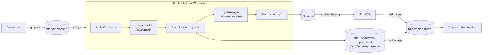

# 🍕 TelebotBot

Telegram-бот, який пропонує швидкі рецепти перекусів для перегляду серіалів та фільмів.

**Бот:** [t.me/course_tele_bot](https://t.me/course_tele_bot)

## Можливості

- 🍕 **Піца на лаваші** — за 15 хвилин
- 🍗 **Курячі нагетси** — хрусткі та соковиті
- 🥑 **Гуакамоле з начос** — класика за 10 хвилин
- 🍟 **Картопля фрі** — запечена в духовці
- 🍗 **Курячі крильця BBQ** — соковиті з медово-соєвим соусом
- 🎉 **Мікс на компанію** — ідеальна дошка для перегляду з друзями

## Встановлення та запуск

### Передумови

- Go 1.21+
- Telegram Bot Token (отриманий через [@BotFather](https://t.me/botfather))

### Крок 1: Клонуй репозиторій

```bash
git clone https://github.com/vladyslav-ops/telebot
cd snackbot
```

### Крок 2: Встанови залежності

```bash
go get ./...
```

### Крок 3: Налаштуй токен

```bash
read -s TELE_TOKEN        # вставити токен бота
export TELE_TOKEN
```

### Крок 4: Збери та запусти

```bash
make build
./snackbot start
```

Або без make:

```bash
go build -ldflags "-X=github.com/your-username/snackbot/cmd.appVersion=v1.0.0" -o snackbot
./snackbot start
```

## Docker

```bash
make image
docker run -e TELE_TOKEN=$TELE_TOKEN your-dockerhub-username/snackbot:v1.0.0-linux-amd64
```

## Команди бота

| Команда  | Опис                          |
|----------|-------------------------------|
| `/start` | Привітання та меню перекусів  |
| `/menu`  | Показати меню знову           |
| `/help`  | Довідка з командами           |

## Makefile

```
make format   — форматування коду
make lint     — перевірка лінтером
make test     — запуск тестів
make get      — встановлення залежностей
make build    — збірка бінарника
make image    — збірка Docker-образу
make push     — push Docker-образу
make clean    — очищення артефактів
```

## CI/CD Pipeline

Повний цикл автоматизовано через **GitHub Actions** → **ghcr.io** → **ArgoCD** → **Kubernetes**.
Pipeline запускається при кожному `push` у гілку `develop`.



**Кроки:**
1. `push` у `develop` запускає workflow [.github/workflows/cicd.yml](.github/workflows/cicd.yml).
2. Збирається бінарник і Docker-образ для `linux/amd64`.
3. Образ публікується в `ghcr.io` з тегом `vX.Y.Z-<sha>-linux-amd64`.
4. Новий тег записується в `helm/values.yaml` і комітиться назад.
5. **ArgoCD** ([argocd/application.yaml](argocd/application.yaml)) відстежує `develop`, синхронізує Helm-чарт і розгортає бота в Kubernetes.

## Стек технологій

- **Go** — мова програмування
- **[cobra](https://github.com/spf13/cobra)** — CLI-фреймворк
- **[telebot.v4](https://gopkg.in/telebot.v4)** — фреймворк для Telegram Bot API

## Ліцензія

MIT